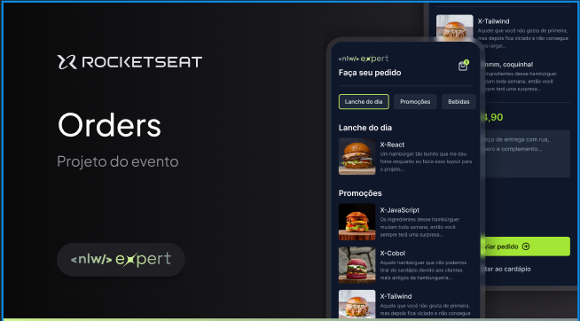

<h1 align="center"> NLW Expert </h1>

Evento exclusivo e gratuito, promovido pela Rocketseat para ensino de tecnologias WEB.

  <a href="#-tecnologias">Tecnologias</a>&nbsp;&nbsp;&nbsp;|&nbsp;&nbsp;&nbsp;
  <a href="#-projeto">Projeto</a>&nbsp;&nbsp;&nbsp;|&nbsp;&nbsp;&nbsp;
  <a href="#memo-licença">Licença</a>

  

 

## 🚀 Tecnologias

Esse projeto foi desenvolvido com as seguintes tecnologias:

- React Native
- React
- Tailwind CSS

## 💻 Projeto

O Offer é um aplicado mobile em que é possivel gerar deliverys e mandá-los por Whatsapp para a empresa. Desde a lógica de operação, Interface e funcionalizades criadas com React Native, com Rodrigo Gonsalves como instrutor.

## :memo: Licença

Esse projeto está sob a licença MIT.

---

Feito com ♥ by Atila Silva e Rocketseat :wave: [Participe da nossa comunidade!](https://discord.gg/rocketseat)